# Códigos del laboratorio 1: "Programación de GPUs con CUDA"
## Contenidos
* En este repositorio se encuentran los códigos propuestos en la Práctica 1 de la asignatura de [Programación de GPUs y Aceleradores](https://github.com/garsanca/GPUs)
* El equipo del laboratorio tiene todo el sw instalado para poder desarrollar, compilar y ejecutar un código en CUDA
* Los códigos que vamos a trabajar están disponibles en la [sección "Ejemplos"](#ejemplos), resumidamente trabajan algunos de los aspectos mostrados en la parte  teórica:
    * suma matrices: ilustra la creación de kernel, gestión de memoria y expresión de paralelismo
    * Multiplicación de matrices: ilustra el uso de jerarquía de memoria en CUDA y uso de librerías optimizadas como cuBLAS
    * Transposición de matrices: ilustra uso eficiente de jerarquía de memoria en CUDA (global-compartida) y uso de herramienta de perfilado para evaluar posibles ineficiencias
    * Debug: ejemplo para ilustrar el depurador en CUDA basado en **gdb**
* Los códigos que se han de entregar están en la [sección "Entrega evaluable"](#entrega-evaluable)
    * Se podrá hacer uso del [google-colab](https://colab.research.google.com/) para poder desarrollar el código, cuyas instrucciones están en el cuaderno de [jupyter](google-colab/CUDA_colab.ipynb) que incluye un caso de uso y compilación de código en CUDA, además de mostrar los pasos a seguir para poder montar el Google-Drive


## Objetivos
* Familiarizarse con la arquitectura CUDA
* Evaluar las mejoras/speedup de GPU vs CPU

# Arquitectura GPUs
## Arquitectura G80/G90/GT200
* Nuevo modelo arquitectura: Arquitectura unificada de shaders 
* Solo hay un tipo de unidad programable para pixels/vertex 
    * Ejecuta todo los tipos de shaders
* Estructura realimentada

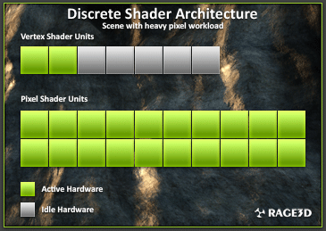
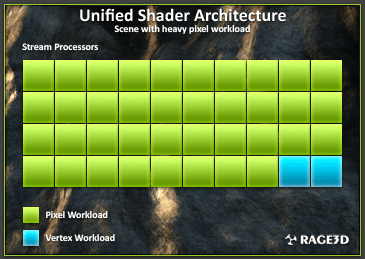

## Arquitectura G80/G90/GT200
* 8 clusters
* Cada cluster tiene un planificador compartida por los 16 SP (ALUs), y unidades de textura

### GPUs vistas como procesador de hilos
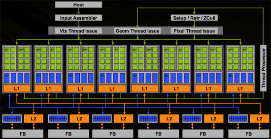

# CUDA 
## Entorno desarrollo
* Instalado CUDA 11.7
    * Ubuntu 22.04 por defecto instalado gcc-10

## Compiladores
* *nvcc* para compilar los ficheros fuente .cu (kernels)
* *g++/gcc* para compilar los ficheros fuente .cpp/.c y enlazar

### nvidia-smi

``` bash
usuario_local@profess11:~$ nvidia-smi
Fri Feb 17 16:02:47 2023
+-----------------------------------------------------------------------------+
| NVIDIA-SMI 515.86.01    Driver Version: 515.86.01    CUDA Version: 11.7     |
|-------------------------------+----------------------+----------------------+
| GPU  Name        Persistence-M| Bus-Id        Disp.A | Volatile Uncorr. ECC |
| Fan  Temp  Perf  Pwr:Usage/Cap|         Memory-Usage | GPU-Util  Compute M. |
|                               |                      |               MIG M. |
|===============================+======================+======================|
|   0  NVIDIA GeForce ...  Off  | 00000000:01:00.0  On |                  N/A |
| 25%   41C    P8    21W / 160W |    463MiB /  6144MiB |      3%      Default |
|                               |                      |                  N/A |
+-------------------------------+----------------------+----------------------+
```


### nvcc
``` bash
usuario_local@profess11:~$ nvcc -V
nvcc: NVIDIA (R) Cuda compiler driver
Copyright (c) 2005-2020 NVIDIA Corporation
Built on Wed_Jul_22_19:09:09_PDT_2020
Cuda compilation tools, release 11.0, V11.0.221
Build cuda_11.0_bu.TC445_37.28845127_0
```

* Procesador Intel i7-8700 con 6 cores + SMT

### cpu_info
``` bash
usuario_local@profess11:~$ more /proc/cpuinfo
processor : 0
vendor_id : GenuineIntel
cpu family : 6
model : 151
model name : 12th Gen Intel(R) Core(TM) i7-12700
stepping : 2
microcode : 0x25
cpu MHz : 2100.000
cache size : 25600 KB
physical id : 0
siblings : 20
core id : 0
cpu cores : 12
apicid : 0
initial apicid : 0
fpu : yes
fpu_exception : yes
cpuid level : 32
wp : yes
flags : fpu vme de pse tsc msr pae mce cx8 apic sep mtrr pge mca cmov pat pse36 clflush dts acpi mmx fxsr sse sse2 ss ht tm pbe sys call nx pdpe1gb rdtscp lm constant_tsc art arch_perfmon pebs bts rep_good nopl xtopology nonstop_tsc cpuid aperfmperf tsc_known_freq pni pclm ulqdq dtes64 monitor ds_cpl vmx smx est tm2 ssse3 sdbg fma cx16 xtpr pdcm pcid sse4_1 sse4_2 x2apic movbe popcnt tsc_deadline_timer aes xsave  avx f16c rdrand lahf_lm abm 3dnowprefetch cpuid_fault epb invpcid_single ssbd ibrs ibpb stibp ibrs_enhanced tpr_shadow vnmi flexpriority ept  vpid ept_ad fsgsbase tsc_adjust bmi1 avx2 smep bmi2 erms invpcid rdseed adx smap clflushopt clwb intel_pt sha_ni xsaveopt xsavec xgetbv1 xsa ves split_lock_detect avx_vnni dtherm ida arat pln pts hwp hwp_notify hwp_act_window hwp_epp hwp_pkg_req umip pku ospke waitpkg gfni vaes vpc lmulqdq tme rdpid movdiri movdir64b fsrm md_clear serialize pconfig arch_lbr flush_l1d arch_capabilities vmx flags : vnmi preemption_timer posted_intr invvpid ept_x_only ept_ad ept_1gb flexpriority apicv tsc_offset vtpr mtf vapic ept vpid unrestricted_guest vapic_reg vid ple shadow_vmcs ept_mode_based_exec tsc_scaling usr_wait_pause
bugs : spectre_v1 spectre_v2 spec_store_bypass swapgs
bogomips : 4224.00
clflush size : 64
```

# Ejemplos
* En este repositorio se encuentran los códigos para que el alumnado conozca las principales caracteristicas de programación de GPUs con el modelo de CUDA
* Antes de nada vamos a conocer las características de la GPU con que trabajaremos en el laboratorio mediante el [código **device_info**](device_info/device_info.cu)
    * Para compilar vamos a utilizar el compilador [NVIDIA CUDA Compiler Driver NVCC **nvcc**](https://docs.nvidia.com/cuda/cuda-compiler-driver-nvcc/)
    * En el fichero [README](device_info/README) muestra la información para compilar el código anterior: ```nvcc device_info.cu``` que generará el ejecutable **a.out**


## Suma matrices
* Partiendo el código siguiente que muestra el esquema de codificación de la suma de vectores en una CPU

``` c
// Compute vector sum C = A+B
void vecAdd(float* A, float* B, float* C,
   int n)
{
   for (i = 0, i < n, i++)
      C[i] = A[i] + B[i];
}

int main()
{
   // Memory allocation for A_h, B_h, C_h
   // I/O to read A_h and B_h, N elements
   ...
   vecAdd(A_h, B_h, C_h, N);
}
```

* Podemos adaptar esa misma idea para a un código CUDA con la construcción del kernel **vecAddkernel**

```c
// Compute vector sum C = A+B
__global__
void vecAddkernel(float* A_d, float* B_d, float* C_d, int n)
{
    int i = threadIdx.x + blockDim.x * blockIdx.x;
    if(i<n) C_d[i] = A_d[i] + B_d[i];
}

int main()
{
   float* A_d, B_d, C_d;
   int size = n* sizeof(float); 

   // Get device memory for A, B, C
   // copy A and B to device memory
   cudaMalloc((void **) &A_d, size);
   cudaMemcpy(A_d, A, size, cudaMemcpyHostToDevice);
   cudaMalloc((void **) &B_d, size);
   cudaMemcpy(B_d, B, size, cudaMemcpyHostToDevice);
   cudaMalloc((void **) &C_d, size);
    
   // Kernel execution in device
   // (vector add in device)
   vecAddkernel<<<nBlocks, nThread_per_Blocks>>>(A_d, B_d, C_d, n);

   // copy C from device memory
   cudaMemcpy(C, C_d, size, cudaMemcpyDeviceToHost);
   // free A, B, C
   cudaFree(A_d); cudaFree(B_d); cudaFree (C_d);
}
```

* En el [código de suma de matrices](matrix_add/main.cu) implementa un esqueleto para la suma de matrices. La función **addMatrix** que se presenta a continuación realiza la suma de matrices **b** y **c** en la CPU. Para compilar dicho código se empleará el compilador **nvcc** como en el ejemplo anterior

```c
void addMatrix(float *a, float *b, float *c, int N)
{
	int i, j, idx;
	for (i=0; i<N; i++)
		for(j=0; j<N;j++){
			idx = i*N+j;
			a[idx]=b[idx]+c[idx];
		}
}
```

* En este ejemplo se pide que el alumnado complete el [código](matrix_add/main.cu), prestando especial atención a:
    1. La reserva de memoria con **cudaMalloc(...)** donde se ha de especificar el tamaño a reservar
    2. La copia de memoria desde el *host* al *device* con las instrucciones **cudaMemcpy(...)**
    3. Indicar el número de bloques e hilos (**dim3 dimBlock(...,...);** y **dim3 dimGrid(...,...)**) de bloques para el kernel ```addMatrixGPU<<<dimGrid,dimBlock>>>(a_GPU, b_GPU, c_GPU, N);```
    4. Rellenar el kernel **addMatrixGPU** que aparece a continuación
    5. Liberar la memoria de la GPU con las instrucciones **cudaFree(...);**

```c
__global__ void addMatrixGPU(float *a, float *b, float *c, int N )
{
	....
}
```

## Multiplicación de matrices
* En este ejemplo vamos a trabajar la multiplicación de matrices descrita como $C_{NM}=A_{NK}*B_{KM}$
    * El código se encuentra en el directorio [**matrix_mult**](matrix_mult/)
```c
   for (i = 0; i < N; i++) {
      for (j = 0; j < M; j++) {
         for (k = 0; k < K; k++) {
            C[i][j] += A[i][k]*B[k][j];
        }
      }
   }
```

    * El fichero [**main.c**](matrix_mult/main.c) lanza la ejecución en la GPU en **Mul(A, B, hA, wA, wB, C);** que se encuentra en el fichero [**matrix_mult.cu**](matrix_mult/matrix_mul.cu)
    * El kernel hay que rellenarlo puesto que está vacío

```c
__global__ void Muld(float* A, float* B, int wA, int wB, float* C)
{
	//To Do
}
```


### To Do
* Rellenar el kernel **Muld** del fichero [**matrix_mult.cu**](matrix_mult/matrix_mul.cu)
    * Se puede comenzar con una implementación 1D
    * Para continuar con la implementación 2D que es la que aparece en el fichero [**matrix_mult.cu**](matrix_mult/matrix_mul.cu)

### Implementación con memoria compartida
* Muchos threads
    * Un Thread por cada Elemento de C[i][j]
    * Cada Thread necesita Fila A[i][:] y Columna B[:][j]
* Podemos Usar Memoria Compartida
    * Cada Block Recorre Filas A[-][:] y Columnas B[:][-]
    * Hay Localidad a nivel de CUDA Block!!


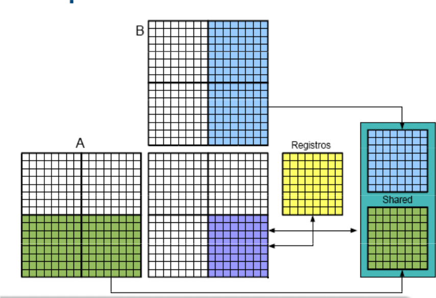

### Implementación mediante librerías
* Haremos uso de la librerías CUBLAS
    * BLAS (Basic Linear Algebra Subroutine)
    * CUBLAS = CUDA + BLAS
    * Operación GEMM:
        * C = $\alpha$ op ( A ) op ( B ) + $\beta$ C
        * $\alpha$ y $\beta$ son escalares
        * $A_{m \times k}$, $B_{k \times n}$ y $C_{n \times n}$ en (column-major)

```
cublasStatus_t cublasSgemm(cublasHandle_t handle,
    cublasOperation_t transa, cublasOperation_t transb,
    int m, int n, int k,
    const float           *alpha,
    const float           *A, int lda,
    const float           *B, int ldb,
    const float           *beta,
    float                 *C, int ldc)
```

* mulMat $\rightleftharpoons$ cublasSgemm
    * Sustitución de invocación a **Muld** por cublasSgemm
    * A tener en cuenta
        * column-major vs. row-major
        * $A*B = (B^T*A^T)^T$

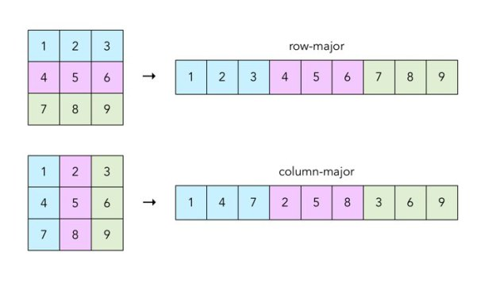

### ToDo
* Comparativa de tiempos de ejecución (GPU-CPU) para la multiplicación de matrices
    * A[4096][1024]*B[1024][2048]
    * A[1024][1024] *B[1024][1024]
    * A[8192][512] *B[512][4096]

## Transposición de matrices
* Transposición de Matrices en el [directorio](matrix_transpose/) 
    * Empleada en multitud de algoritmos: FFT
    * PROBLEMA: Accesos a memoria no eficientes en GPU

### Versión CPU
* Codigo disponible en el [directorio matrix_transpose/CPU](matrix_transpose/CPU/transpose.c) 
    * Compilación mediante fichero [Makefile](matrix_transpose/CPU/Makefile): *gcc -o exec source.c -fopenmp*
    * Explotación de paralelismo a nivel de thread: OpenMP


| Version      | Cores | Rendimiento | 
|:------------:|-------|-------------|
|   1D         | ¿?    | 380 MB/s    |
|   2D         | 1     | 365 MB/s    |
|              | 2     | 696 MB/s    |
|              | 4     | 859 MB/s    | 

## Versión GPU
* ToDo: versión 1D
* Versión 2D: problema accesos a memoria 

```c
__global__ void transpose_device(float *in, float *out, int rows, int cols) 
{ 
   int i, j; 
   i = ??
   j = ??

   if (i<?? && j<??)
      out [ i * rows + j ] = in [ j * cols + i ]; 
}
```

* Rendimiento alcanzado en una GTX980

| **CPU** | **CPU 4ths** | **CUDA 1D**    | **CUDA 2D**  |
|:-------:|:------------:|:--------------:|:------------:|
| 380MB/s |   859MB/s    | 1219 MB/s      |  2014 MB/s   | 

### Profiling
* CUDA profiler: **nvprof**

```bash
carlos@7picos: $ nvprof ./transpose
./exec n (by default n=4096)
Transpose version 1D: 381.636146 MB/s
==29936== NVPROF is profiling process 29936, command: ./transpose
Transpose kernel version: 4950.878007 MB/s
==29936== Profiling application: ./transpose
==29936== Profiling result:
Time(%)      Time     Calls       Avg       Min       Max  Name
 47.10%  10.468ms         1  10.468ms  10.468ms  10.468ms  [CUDA memcpy DtoH]
 42.61%  9.4681ms         1  9.4681ms  9.4681ms  9.4681ms  [CUDA memcpy HtoD]
 10.29%  2.2867ms         1  2.2867ms  2.2867ms  2.2867ms  transpose_device(float*, float*, int, int)

==29936== API calls:
Time(%)      Time     Calls       Avg       Min       Max  Name
 85.07%  130.76ms         2  65.381ms  360.05us  130.40ms  cudaMalloc
 14.57%  22.390ms         2  11.195ms  9.5133ms  12.877ms  cudaMemcpy
  0.24%  370.00us        91  4.0650us     122ns  193.84us  cuDeviceGetAttribute
  0.07%  108.08us         1  108.08us  108.08us  108.08us  cuDeviceTotalMem
  0.02%  33.740us         1  33.740us  33.740us  33.740us  cudaLaunch
  0.02%  28.259us         1  28.259us  28.259us  28.259us  cuDeviceGetName
  0.00%  5.4260us         1  5.4260us  5.4260us  5.4260us  cudaThreadSynchronize
  0.00%  5.2270us         4  1.3060us     147ns  4.3870us  cudaSetupArgument
  0.00%  1.9540us         1  1.9540us  1.9540us  1.9540us  cudaConfigureCall
  0.00%  1.5640us         3     521ns     124ns  1.2540us  cuDeviceGetCount
  0.00%     853ns         3     284ns     122ns     487ns  cuDeviceGet
```


* CUDA profiler: **nvvp**
    * Aplicación gráfica con mayor precisión
* Para mayor detalle consultar la opción **Profile Nsight Compute**
* Versión v1 de la transposición de matrices: *Achieved Occupancy 27,25%*


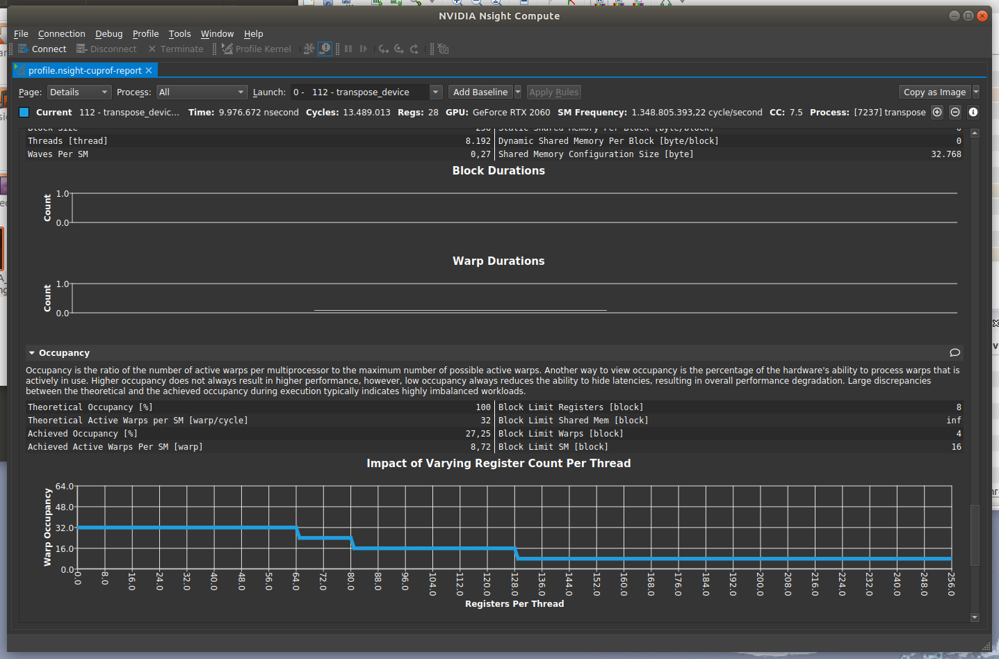

* **Profile in NVIDIA Nsight Compute**: versión v2 de la transposición de matrices: *Occupancy 59.31%*

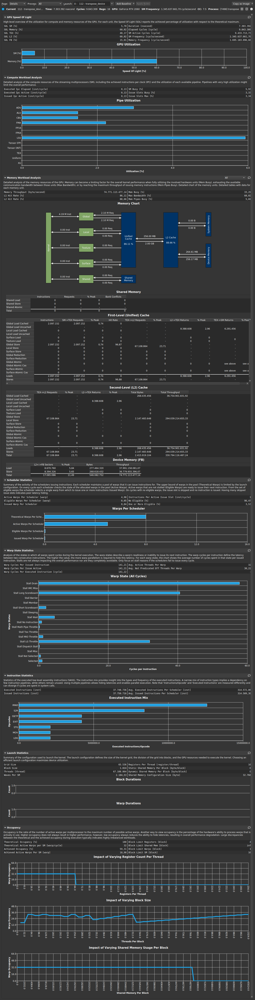


* Versión v2 de la transposición de matrices: **Accesos alineados/desalineados**

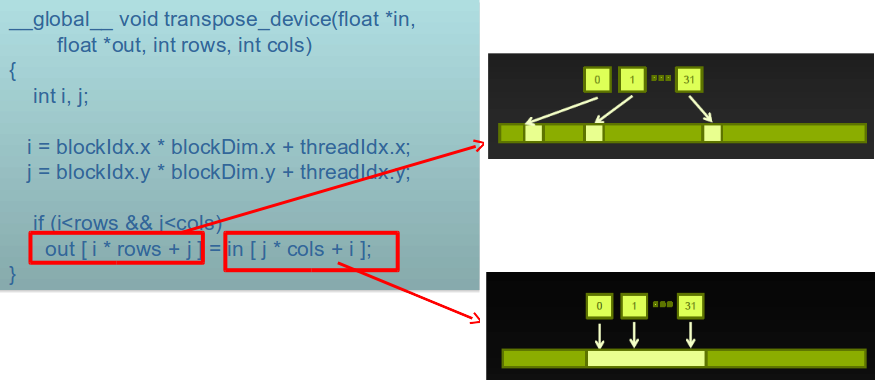

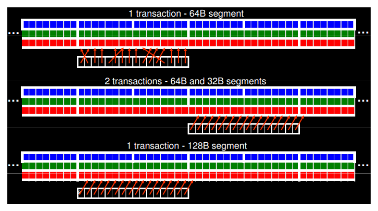

* Versión v3 de la transposición de matrices: **shared-memory**
    * Más rápida en comparación con la memoria global
    * Baja latencia
    * Alto Ancho de banda
* Load: Copia de un bloque a Global $\Rightarrow$ memoria compartida
* Store: Copia de un memoria compartida $\Rightarrow$ mem Global

### Optimización de memoria Global
* Versión v3 de la transposición de matrices: **shared-memory**

```c
#define TILE_DIM 16

__global__ void transpose_device(float *in, float *out, int rows, int cols)
{ 
   int i, j; 
   __shared__ float tile [ TILE_DIM ] [ TILE_DIM ]; 

   i = blockIdx.x * blockDim.x + threadIdx.x; 
   j = blockIdx.y * blockDim.y + threadIdx.y; 

   if (i<rows && j<cols) {
      tile[?] [?]...
      __syncthreads(); 
      i = ? ;
      j = ? ;
      out[ i * rows + j ] ...
   }
}
```

* Rendimiento alcanzado en una GTX980

| **CPU** | **CPU 4ths** | **CUDA 1D**    | **CUDA 2D**  | **CUDA 2D + Shared** | 
|:-------:|:------------:|:--------------:|:------------:|:--------------------:|
| 380MB/s |   859MB/s    | 1219 MB/s      |  2014 MB/s   | 5213 MB/s            | 

* Versión v3 de la transposición de matrices: **shared-memory**
    * Consultar **Shared Memory** con **Bank Conflicts** 

### Optimización memoria compartida   
* Versión v4 de la transposición de matrices: **sin conflicto en shared**

```c
#define TILE_DIM 16

__global__ void transpose_device(float *in, float *out, int rows, int cols)
{ 
   int i, j; 
   __shared__ float tile [ TILE_DIM ] [ TILE_DIM+1 ]; 

   i = blockIdx.x * blockDim.x + threadIdx.x; 
   j = blockIdx.y * blockDim.y + threadIdx.y; 

   if (i<rows && j<cols) {
      tile[?] [?]...
      __syncthreads(); 
      i = ? ;
      j = ? ;
      out[ i * rows + j ] ...
   }
}
```

* Versión v4 de la transposición de matrices: **sin conflicto en shared**


### Perfilado con **ncu**
* El [NVIDIA Nsight Compute Command Line Interface](https://docs.nvidia.com/nsight-compute/NsightComputeCli/index.html) tiene un interfaz de uso también por línea de comandos que puede ser usado desde la consola que nos devuelve valores interesantes para el usuario como
    * GPU Speed of Light Throughtput
    * Occupancy
    * Statistics

```bash
usuario_local@profess11:~$ ncu --print-summary none ./transpose
ncu --print-summary none ./transpose
./exec n (by default n=8192)
==PROF== Connected to process 69516 (/tmp/GPUs/src/lab1/matrix_transpose/CUDA.v1/transpose)
Transpose version 1D: 385.682734 MB/s
==PROF== Profiling "transpose_device" - 0: 0%....50%....100% - 9 passes
Transpose kernel version: 712.778220 MB/s tKernel=0.359158 (us)
==PROF== Disconnected from process 69516
[69516] transpose@127.0.0.1
  transpose_device(float *, float *, int, int), 2023-Mar-17 14:00:06, Context 1, Stream 7
    Section: GPU Speed Of Light Throughput
    ---------------------------------------------------------------------- --------------- ------------------------------
    DRAM Frequency                                                           cycle/nsecond                           6,72
    SM Frequency                                                             cycle/nsecond                           1,35
    Elapsed Cycles                                                                   cycle                     13.490.336
    Memory [%]                                                                           %                          44,19
    DRAM Throughput                                                                      %                          19,27
    Duration                                                                       msecond                           9,97
    L1/TEX Cache Throughput                                                              %                          67,40
    L2 Cache Throughput                                                                  %                          44,19
    SM Active Cycles                                                                 cycle                   9.420.231,80
    Compute (SM) [%]                                                                     %                           4,17

```

* Incluso se puede sacar información a nivel de **kernel** con la opción **per-kernel**

```bash
usuario_local@profess11:~$ ncu --print-summary per-kernel ./transpose
./exec n (by default n=8192)
==PROF== Connected to process 69642 (/tmp/GPUs/src/lab1/matrix_transpose/CUDA.v1/transpose)
Transpose version 1D: 375.514682 MB/s
==PROF== Profiling "transpose_device" - 0: 0%....50%....100% - 9 passes
Transpose kernel version: 721.681744 MB/s tKernel=0.354727 (us)
==PROF== Disconnected from process 69642
[69642] transpose@127.0.0.1
  transpose_device(float *, float *, int, int), Block Size 256, Grid Size 32, Device 0, 1 invocations 
    Section: GPU Speed Of Light Throughput
    Metric Name                                                      Metric Unit   Minimum         Maximum         Average        
    ---------------------------------------------------------------- ------------- --------------- --------------- ---------------
    dram__cycles_elapsed.avg.per_second                              cycle/nsecond 6.701347        6.701347        6.701347       
    gpc__cycles_elapsed.avg.per_second                               cycle/nsecond 1.348120        1.348120        1.348120       
    gpc__cycles_elapsed.max                                          cycle         13479154.000000 13479154.000000 13479154.000000
    gpu__compute_memory_throughput.avg.pct_of_peak_sustained_elapsed %             44.233118       44.233118       44.233118      
    gpu__dram_throughput.avg.pct_of_peak_sustained_elapsed           %             19.357729       19.357729       19.357729      
    gpu__time_duration.sum                                           msecond       9.989888        9.989888        9.989888       
    l1tex__throughput.avg.pct_of_peak_sustained_active               %             67.446880       67.446880       67.446880      
    lts__throughput.avg.pct_of_peak_sustained_elapsed                %             44.233118       44.233118       44.233118      
    sm__cycles_active.avg                                            cycle         9440141.700000  9440141.700000  9440141.700000 
    sm__throughput.avg.pct_of_peak_sustained_elapsed                 %             4.181825        4.181825        4.181825

```

* También se puede generar un fichero de traza con la opción **-o** que luego puede ser visualizado de con la herramienta **ncu-ui**

```bash
usuario_local@profess11:~$ ncu -o out --set detailed ./transpose 
./exec n (by default n=8192)
==PROF== Connected to process 69807 (/tmp/GPUs/src/lab1/matrix_transpose/CUDA.v1/transpose)
Transpose version 1D: 385.661817 MB/s
==PROF== Profiling "transpose_device" - 0: 0%....50%....100% - 18 passes
Transpose kernel version: 355.037300 MB/s tKernel=0.721050 (us)


usuario_local@profess11:~$ ncu-ui out.ncu-rep

```

### ToDo

* Del ejemplo de la transposición de matrices v1, que contenía muchas accesos a memoria no "coalescentes" el profiler refleja varios avisos que son interesantes seguir para mejorar el rendimiento global de la aplicación que paso a resumir:
    * **Small Grid**: This kernel grid is too small to fill the available resources on this device, resulting in only 0.3 full waves across all SMs 
    * **Low Utilization**: All compute pipelines are under-utilized...
    * **Uncoalesced Global Accesses**: This kernel has uncoalesced global accesses resulting in a total of 58720256 excessive sectors (78% of the total 75497472 sectors). 
    
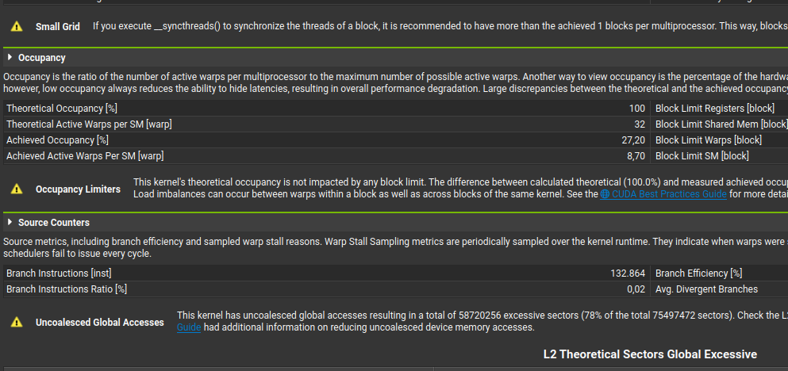


## Debuging
* Dentro del toolkit de CUDA existe una herramienta de depuración: [cuda-gdb](http://docs.nvidia.com/cuda/cuda-gdb)
    * Requisitos: habilitar las opciones de depuración **-g -G** en el **nvcc**: ```nvcc -g -G fuente.cu -o exec```
* Como funciona:
    * Se puede solicitar la información del dispositivo, bloque y thread, imprimiendo variables y cambiando los valores de las variables
    * Para ello es posible conmutar entre *bloque y thread*
* El ejemplo de código está en el [directorio](debug/)

```bash
carlos@posets:~/cuda-gdb ./exec
(cuda-gdb) cuda device sm warp lane block thread 
block (0,0,0), thread (0,0,0), device 0, sm 0, warp 0, lane 0

(cuda-gdb) cuda kernel block thread 
kernel 1, block (0,0,0), thread (0,0,0) 

(cuda-gdb) cuda kernel 
kernel 1
```
     * ¿Como conmutar?: en linea de comando con *cuda block ID thread ID*
     
```bash
(cuda-gdb) cuda block 1 thread 3 
[Switching focus to CUDA kernel 1, grid 2, block (1,0,0), thread (3,0,0), device 0, sm 3, warp 0, lane 3]
```

### ToDo
* Compilar con las opciones de depuración e invocar el depurador (cuda-gdb) 
    * Excepción de la línea 17: *CUDA_EXCEPTION_10*
        * Identificar que significa esa excepción en la [URL](http://docs.nvidia.com/cuda/cuda-gdb)
        * API de *gdb* consultable en [**gdb cheatsheet**](http://users.ece.utexas.edu/~adnan/gdb-refcard.pdf)

```bash
(cuda-gdb) run 
Starting program: /.../example 
[Thread debugging using libthread_db enabled]
Using host libthread_db library "/lib64/libthread_db.so.1".
[New Thread 0x7ffff5d0e700 (LWP 22874)]

CUDA Exception: Device Illegal Address
The exception was triggered in device 0.

Program received signal CUDA_EXCEPTION_10, Device Illegal Address.
[Switching focus to CUDA kernel 0, grid 1, block (3,0,0), thread (32,0,0), device 0, sm 7, warp 1, lane 0]
0x0000000000811a98 in example(int * @global * @global)<<<(8,1,1),(64,1,1)>>> (data=0x902f20000) at autostep.cu:17
17		*(data[idx1]) = value3;
```
* ¿Como proceder?
    * Introducir *breakpoint* en línea anterior (16)
    * Cambiar contexto (*block* y *thread*)
    * NOTA: el error se muestra para un *warp* en cuestión no para el hilo correspondiente
* Preguntas
    * ¿Qué *thread* ha sido el causante del error?
    * ¿Por qué?
    
### Extensión Visual-Code
* Existe la posibilidad de añadir una extensión dentro del [Visual Code](https://code.visualstudio.com/) para permitir la depuración integrada mediante el **cuda-gdb**
* La extensión se llama [**Nsight Visual Studio Code Edition**](https://marketplace.visualstudio.com/items?itemName=NVIDIA.nsight-vscode-edition)
    * Para añadirla a MS-Vcode clicar en la barra de la izquierda->extensiones o con el ataja "Ctrl+Mayúsc+X" y buscar "Nsight Visual Studio Code Edition"
    * Una vez instalada la extensión es necesario configurar la opción de depuración en el fichero "launch.json" y añadir el depurador mediante el **cuda-gdb** y añadir el programa a depurar previamente compilado con las opciones **-g -G**
    
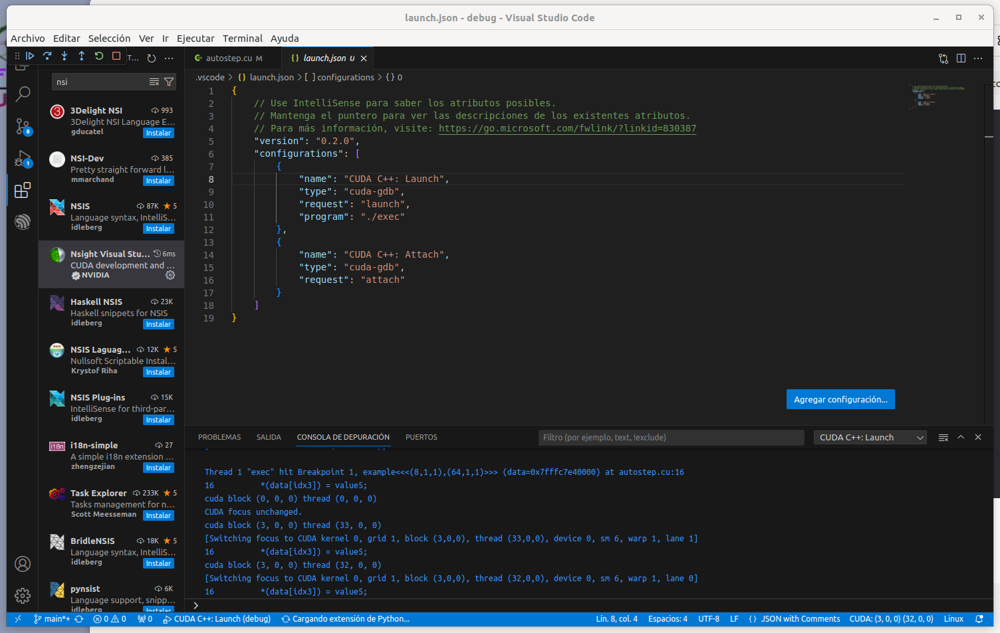

* Proceso de depuración:
    1. Ejecutar proceso de depuración con "F5" o Menú Ejecutar->Iniciar depuración
    2. Añadir breakpoint 
    3. Conmutar de hilo-bloque, para ello pinchar en la barra inferior azul "CUDA: (0, 0, 0) (0, 0, 0). Ver figura adjunta
    4. Proceder a la depuración mediante la visuación de Variables o Inspeccionando expresiones


    
    
# Entrega evaluable
## Lane-assist
* Aplicación de tratamiento de imágenes incluida en los vehículos actuales
* Código disponible en directorio [lane-assist](lane-assist)
* Se basa en algoritmos de tratamiento de imágenes
    * Detección de bordes: **Filtrado canny**
    * Detección de líneas: **Transformada de Hough**


### Ejecutable
* Sintasis:
* **./image input_image.png [c,g]**
    * c: código ejecutado en CPU
    * g: código ejecutado en GPU


### Detección de bordes
* Detección de bordes: **Filtrado canny**
    * Basado en **convolución 2D**


* ¿Que es la operación de convolución?


* Etapas
    1. Reducción de ruido (filtro *blur*)
    2. Gradiente de la imagen
    3. Supresión no-máximo

### Reducción de ruido (convolución 2D)

$Out(i,j) = \frac{1}{159} \begin{bmatrix}
2 &  4 &  5 &  4 & 2 \\ 
4 &  9 & 12 &  9 & 4 \\ 
5 & 12 & 15 & 12 & 5 \\ 
4 &  9 & 12 &  9 & 4 \\ 
2 &  4 &  5 &  4 & 2
\end{bmatrix} In(i-2:i+2,j-2:j+2)$


### Gradiente de la imagen
* $Gx(i,j) = \begin{bmatrix}
1 &  2 & 0 &  -2 & -1 \\ 
4 &  8 & 0 &  -8 & -4 \\ 
6 & 12 & 0 & -12 & -6 \\ 
4 &  8 & 0 &  -8 & -4 \\ 
1 &  2 & 0 &  -2 & -1 \\ 
\end{bmatrix} NR(i-2:i+2,j-2:j+2)$

* $G = \sqrt{{G_x}^2+{G_y}^2}$
* $\phi = \arctan2({G_x}^{2},{G_y}^{2})$

### Supresión no-máximo
* Determina si la magnitud del gradiente (G) es máximo local (redondeo $\phi\in 0^{\circ},45^{\circ},90^{\circ},135^{\circ}$)
    * Umbral de histéresis: dos umbrales alto y bajo
        * Si el gradiente G>umbral_alto $\Rightarrow$ **borde**
        * Si el gradiente G>umbral_bajo y **es máximo local** $\Rightarrow$ **borde**

* Máximo local
    * Si $\phi=0^{\circ}$ (borde N o S) si $G>G_E$ y $G>G_W$
    * Si $\phi=90^{\circ}$ (borde E o W) si $G>G_N$ y $G>G_S$
    * Si $\phi=135^{\circ}$ (borde NE o SW) si $G>G_{NW}$ y $G>G_{SE}$
    * Si $\phi=45^{\circ}$ (borde NW o SE) si $G>G_{NE}$ y $G>G_{SW}$

### Transformada de Hough
* Tomaremos como ejemplo la transformada de Hough bastante común en tratamiento de imágenes
    * Más [info](https://es.wikipedia.org/wiki/Transformada_de_Hough)
* Después de aplicar un detector de bordes a una imagen (ej: operador Sobel, Canny)


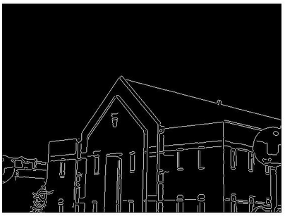

* La transformada de Hough es útil en muchos algoritmo de detección de líneas en una imagen
    * Emplea un sistema votador

* Para detectar una recta revisamos la representación matemática:  $y=m*x+n$
    * Donde $(x,y)$ corresponde a cada píxel de la imagen: **problema con líneas verticales**: $m=\infty$
* También se puede representar en coordenadas polares: $y=-\frac{\cos{\theta}}{\sin{\theta}}*x+ \frac{\rho}{\sin{\theta}}$
* O finalmente como ${\rho}=x*\cos{\theta}+y*\sin{\theta}$ asociando a cada recta el par $(\rho, \theta)$

* Implementación de la transformada de Hough
    * El algoritmo de Hough almacena el resultado una **matriz acumulador** (votación) para cada píxel: 

``` code
[1] cargar imagen
[2] detectar los bordes en la imagen
[3] por cada punto en la imagen:
[4]    si el punto (x,y) esta en un borde:
[5]       por todos los posibles ángulos theta:
[6]          calcular rho para el punto (x,y) con un ángulo theta
[7]          incrementar la posición (rho, theta) en el acumulador
[8] buscar las posiciones con los mayores valores en el acumulador
[9] devolver las rectas cuyos valores son los mayores en el acumulador.
```


### Implementación
* Esqueleto del código: *main.c* y *kernel.h*
* Modificación del código fuente *kernel.cu*
* Imágenes de prueba en directorio **images**

``` c
#include <stdio.h>
#include <stdlib.h>
#include <math.h>
#include <cuda.h>

#include "routinesGPU.h"

void line_asist_GPU(uint8_t *im, int height, int width,
	uint8_t *imEdge, float *NR, float *G, float *phi, float *Gx, float *Gy, uint8_t *pedge,
	float *sin_table, float *cos_table, 
	uint32_t *accum, int accu_height, int accu_width,
	int *x1, int *x2, int *y1, int *y2, int *nlines)
{

	/* To do */
}
```

* A tener en cuenta
    * Explotación del máximo paralelismo en un kernel
    * Explotación de jerarquía de memoria si hay reuso de información
    * Dependencias de datos entre etapas (se pueden resolver con kernels distintos)
    * Operaciones de tipo "incremento" o ```i++``` no son eficientes en GPU (read-write sharing variable)
        * [Ver enlace](https://developer.nvidia.com/blog/faster-parallel-reductions-kepler/)
        * Posibilidad de implementar con instruciones **atomic**

