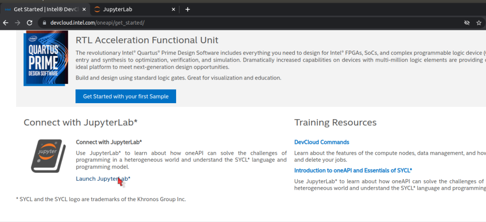
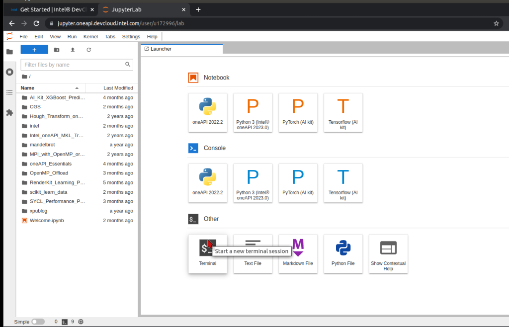
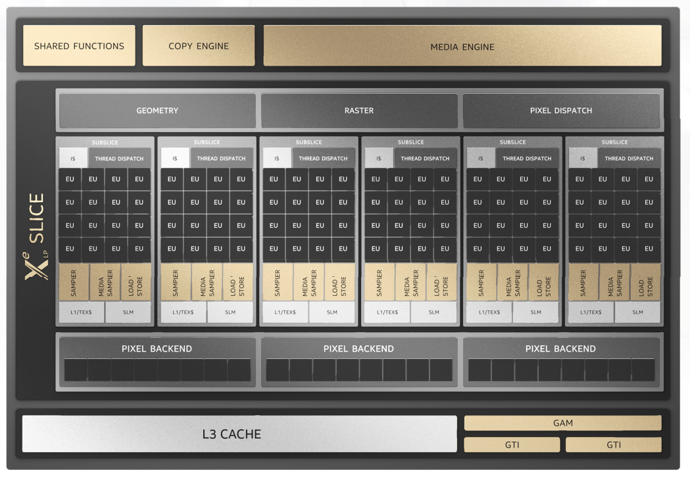
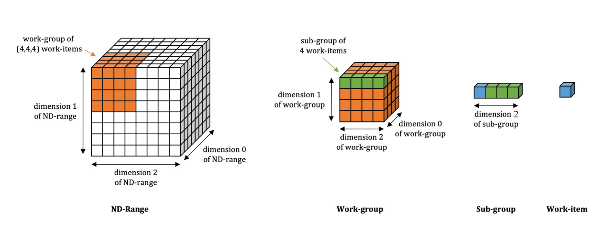
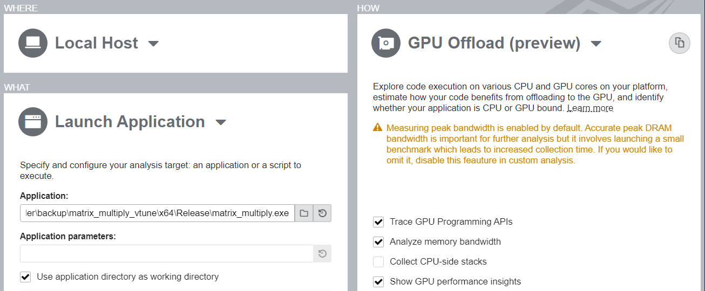
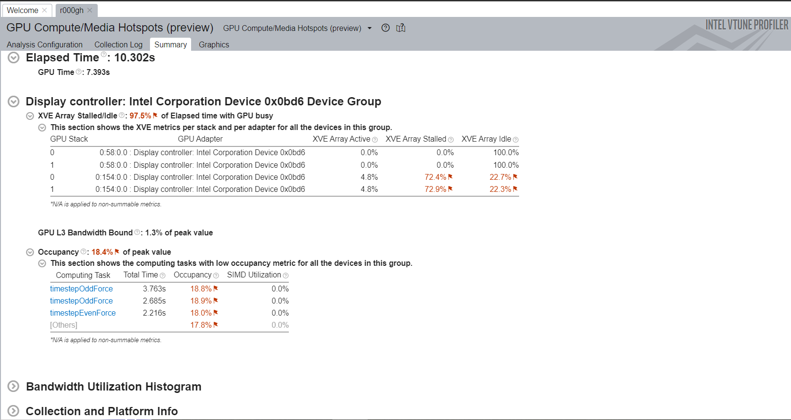
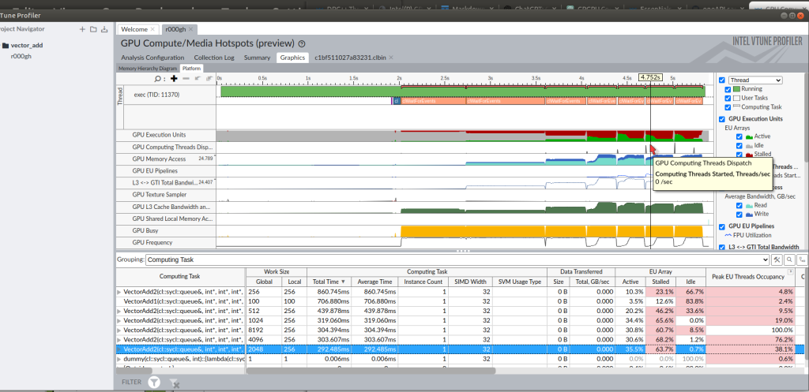
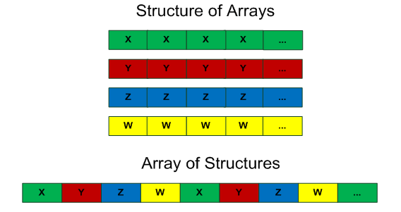
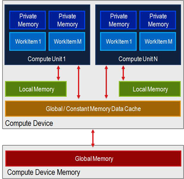
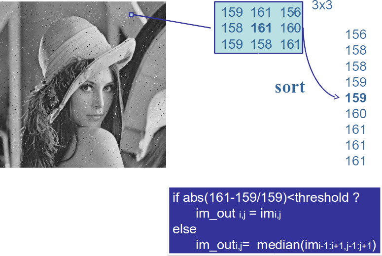

# Códigos del laboratorio 2: "Programación de GPUs y Aceleradores con SYCL"

## Contenidos
* En este repositorio se encuentran los códigos propuestos en la Práctica 2 de la asignatura de [Programación de GPUs y Aceleradores](https://github.com/garsanca/GPUs)
* Para poner a punto el taller se recomienda seguir los pasos de la sección [Setup del lab](#setup-del-lab)
* Los códigos que vamos a trabajar están disponibles en la [sección "Ejemplos"](#ejemplos), resumidamente trabajan algunos de los aspectos mostrados en la parte teórica:
    * helloWorld: ilustra la selección de dispositivos
    * Memoria Buffer & Accessors: uso de buffers y accesors
    * Memoria USM: uso de USM
    * Suma de vectores: suma de vectores
    * Optimización en GPUs
    * Multiplicación de matrices
* Los códigos que se han de entregar están en la [sección "Entrega evaluable"](#entrega-evaluable)

# Setup del lab

## Transparencias
* Todo el material está disponible en el repositorio [github](https://github.com/garsanca/GPUs/tree/main/src/lab2)
    * Puede descargarse fácilmente clonando el repositorio ejecutando en un terminal el comando ```git clone https://github.com/garsanca/GPUs```

## Laboratorios FDI
* En los laboratorio está instalado el entorno de [oneAPI](https://www.oneapi.io/) para que pueda ser utilizado por los alumnos
* Únicamente hay que tener en cuenta 3 cuestiones:
     1. Está instalado en el sistema operativo **GNU-Linux**
     2. El entorno (compiladores, herramientas y librerías) se activan cargando el script **setvars.sh**: ```source /opt/intel/oneapi/setvars.sh```. Es importante hacerlo cada vez que se abra una consola o terminal
     3. Para que el compilador **dpcpp** o **icx** habilite la lambdas con SYCL se suele compilar con el flags `-fsycl` y para poder usar las GPUs de NVIDIA se debería compilar con los flags `-fsycl -fsycl-targets=nvptx64-nvidia-cuda`. A modo de ejemplo indico la línea de compilación global para un archivo: ```icpx -fsycl -fsycl-targets=nvptx64-nvidia-cuda -o exec.cuda main.cpp```

```bash
user@host:~/ $ source /opt/intel/oneapi/setvars.sh 
 
:: initializing oneAPI environment ...
   bash: BASH_VERSION = 5.1.16(1)-release
   args: Using "$@" for setvars.sh arguments: 
:: advisor -- latest
:: ccl -- latest
:: clck -- latest
:: compiler -- latest
:: dal -- latest
:: debugger -- latest
:: dev-utilities -- latest
:: dnnl -- latest
:: dpcpp-ct -- latest
:: dpl -- latest
:: inspector -- latest
:: intelpython -- latest
:: ipp -- latest
:: ippcp -- latest
:: ipp -- latest
:: itac -- latest
:: mkl -- latest
:: mpi -- latest
:: tbb -- latest
:: vpl -- latest
:: vtune -- latest
:: oneAPI environment initialized ::
 
user@host:~/ $ sycl-ls 
[opencl:acc:0] Intel(R) FPGA Emulation Platform for OpenCL(TM), Intel(R) FPGA Emulation Device 1.2 [2023.15.3.0.20_160000]
[opencl:cpu:1] Intel(R) OpenCL, 13th Gen Intel(R) Core(TM) i7-13700 3.0 [2023.15.3.0.20_160000]
[ext_oneapi_cuda:gpu:0] NVIDIA CUDA BACKEND, NVIDIA GeForce RTX 3070 0.0 [CUDA 12.2]

```


## Cuenta en DevCloud
* El [Intel® DevCloud for oneAPI](https://devcloud.intel.com/oneapi/) es un espacio de desarrollo **gratuito** para que la comunidad de desarrolladores puedan programar aplicaciones
    * Múltiples **hw**: 
        * **CPUs**: desktop *i9-11900* y servidor tipo Xeon diferentes arquitecturas (Skylake,  Ice Lake, Sapphire Rapids)
        * **GPUs**: integradas UHD Intel® Core™ Gen9 y Gen11 
        * **FPGAs**: Arria 10 y Stratix 10
    * **sw**: oneAPI divididos en [Toolkits](https://www.intel.com/content/www/us/en/developer/tools/oneapi/toolkits.html#gs.pd8yyt)
        * Compiladores: C/C++ y Fortran
        * Herramientas de perfilado: VTune, Advisor, GDB
        * Librerías optimizadas: oneMKL, oneDPL, oneVPL, oneDNN...
* Solicitud de cuenta gratuita [rellenando formulario](https://www.intel.com/content/www/us/en/forms/idz/devcloud-registration.html?tgt=https://www.intel.com/content/www/us/en/secure/forms/devcloud-enrollment/account-provisioning.html)
    * o bien en la web del [Intel® DevCloud for oneAPI](https://devcloud.intel.com/oneapi/) en la opción **Enroll**
    * **Importante** usar correo de UCM porque tiene una duración de uso mayor
    * Se recibirá un correo electrónico con instrucciones de uso


## Conexión a DevCloud
* Existen varios mecanismos de [conexión al Intel DevCloud](https://devcloud.intel.com/oneapi/documentation/connect-with-ssh-linux-macos/)


* La más sencilla es abrir un cuaderno de Jupyter
    1. Una vez logeado en la web del [Intel® DevCloud for oneAPI](https://devcloud.intel.com/oneapi/) en la opción **Sign In** (esquina superior derecha)
    2. Ir a la opción **"Get Started"** en la banda superior azul
    3. Clicar sobre **"Launch JupyterLab"** en la parte inferior izquierda o en el [atajo](https://jupyter.oneapi.devcloud.intel.com/hub/login?next=/lab/tree/Welcome.ipynb?reset)



## Entorno Jupyter
* El [Intel® DevCloud for oneAPI] contiene un entorno JupyterLab



* En la parte de la izquierda tiene un navegador de ficheros del usuario
    * Como funcionalidad útil, se pueden arrastrar fichero del equipo del *host* y automáticamente se llevan al DevCloud sin necesidad de hacer un sftp
* En la parte de la derecha contiene las principales aplicaciones disponibles:
    * **Notebook o cuaderno de Jupyter** que usaremos en el taller para ilustrar el funcionamiento del "Data Parallel C++"
    * **Consola** o terminal para interactuar con el sistema

## Cuadernos de Jupyter
* Los cuadernos de Jupyter o **Notebook** están estructurados en cajas denominadas **celdas**
    * Pueden contener celdas de texto (explicativo)
    * También celdas de código C++ o python que se ejecutan de forma interactiva pulsando el botón **▶** o con el "atajo" *Shifth+Enter*
    * En el navegador de fichero, el cuaderno "oneAPI_Essentials/00_Introduction_to_Jupyter/Introduction_to_Jupyter.ipynb" contiene más información y un vídeo explicativo del funcionamiento
        * También es accesible en el [enlace](https://jupyter.oneapi.devcloud.intel.com/hub/login?next=/lab/tree/oneAPI_Essentials/00_Introduction_to_Jupyter/Introduction_to_Jupyter.ipynb?reset)

* Además podéis encontrar [más info](https://eprints.ucm.es/id/eprint/48304/1/ManualJupyter.pdf)

## Ejecución en terminal (sistema colas)
* El [Intel® DevCloud for oneAPI](https://devcloud.intel.com/oneapi/) dispone de un sistema de colas para poder ejecutar las tareas
* El lanzamiento de trabajo se realiza mediante [jobs](https://devcloud.intel.com/oneapi/documentation/job-submission/)
* Existen dos formas de utilizar un nodo GPU: interactivo o trabajo tipo batch
    * Para solicitar una sesión de forma interactiva con el comando qsub ```qsub -I -l nodes=1:gpu:ppn=2 -d .```
        * ```-l nodes=1:gpu:ppn=2``` asigna un nodo completo con GPU
        * ```-d``` indica que la sesión abierta en el nodo se realiza en el mismo directorio que el lanzamiento de qsub
    * En un lanzamiento de tipo batch el trabajo se encola hasta que hay un slot disponible. La sintaxis es ```qsub -l nodes=1:gpu:ppn=2 -d . job.sh```
        * Donde el script job.sh contiene la secuencia de órdenes a lanzar

Un ejemplo del fichero job.sh sería el siguiente donde se muestra la hora de comienzo del job y su hora de finalización:
```bash
#!/bin/bash

echo
echo start: $(date "+%y%m%d.%H%M%S.%3N")
echo

# TODO list

echo
echo stop:  $(date "+%y%m%d.%H%M%S.%3N")
echo
```

* Para conocer las colas disponibles en el Intel DevCloud se puede utilizar el comando **pbsnodes**. Con el siguiente comando se conocen las propiedades de los nodos existentes ``` pbsnodes | sort | grep properties```

* Para más información relacionada con el lanzamiento de trabajos en el DevCloud se puede consultar la [documentación](https://devcloud.intel.com/oneapi/documentation/job-submission/)

# Ejemplos

## helloWorld
1. En este [ejemplo](helloWorld/main.cpp) vamos a ver como se selecciona un dispositivo
2. Como se elige el dispositivo: **sycl::device**
    * Lanzamiento de **kernel** a la *command-queue* asíncrona

* La siguiente tabla muestra la nomenclatura para seleccionar y asociar la cola a los dispositivos

|   |   |
|---|---|
|**type**                 | **Device**                                                   |
| default\_selector_v     | Selects any device or host device if no device can be found  |
| gpu\_selector_v         | Select a GPU                                                 |
| accelerator\_selector_v | Select an accelerator                                        |
| cpu\_selector_v         | Select a CPU device                                          |
|*my\_device\_selector*   | *Custom selector*                                            | 


* El siguiente [código](helloWorld/main.cpp) disponible en el directorio [helloWorld](helloWorld/) muestra un ejemplo de selección, donde
    * La línea ```d = sycl::device(sycl::gpu_selector_v);``` seleccione el dispositivo
    * La clase ```d.get_info``` devuelve informacion asociada al dispositivo
    * el ```single_task``` escribe en la salida la cadena "Hello, World!", que está asociada a la ejecución en el **dispositivo seleccionado**


```c
#include <CL/sycl.hpp>

using  namespace  cl::sycl;

int main(int argc, char **argv) {

	sycl::queue Q(sycl::gpu_selector_v);

	std::cout << "Running on "
		<< Q.get_device().get_info<sycl::info::device::name>()
		<< std::endl;

	Q.submit([&](handler &cgh) {
		// Create a output stream
		sycl::stream sout(1024, 256, cgh);
		// Submit a unique task, using a lambda
		cgh.single_task([=]() {
			sout << "Hello, World!" << sycl::endl;
		}); // End of the kernel function
	});   // End of the queue commands. The kernel is now submited

	// wait for all queue submissions to complete
	Q.wait();


  return 0;

```

* Para compilar los código existe un fichero [Makefile](helloWorld/Makefile) que invocando **make** en consola genera el ejecutable **exec**

```bash
user@host:~/ $make
icpx -fsycl -fsycl-targets=nvptx64-nvidia-cuda -c -o main.o main.cpp -I.
icpx -fsycl -fsycl-targets=nvptx64-nvidia-cuda -o exec main.o -I. -L/usr/lib/gcc/x86_64-linux-gnu/11 
user@host:~/ $ ls
exec  main.cpp  main.o  Makefile

user@host:~/ $ ./exec
Running on NVIDIA GeForce RTX 3070
Hello, World!

```
### ToDo
* Se recomienda experimentar con el cambio de **selector** para seleccionar CPU/GPU...

## Memoria Buffer & Accessors
* En este [ejemplo](mem_buffersAccesors/main.cpp) vamos a ilustrar el uso de memoria entre el host y el device con **buffers** y **accesors**


* Vamos a ilustrar el ámbito de uso de los **buffers** y **accessors**
    1. Creación y tiempo de vida 
    2. ¡¡¡ **Problema de sincronización** !!!

``` c
sycl::queue Q(sycl::gpu_selector{});

std::cout << "Running on "
	<< Q.get_device().get_info<sycl::info::device::name>()
	<< std::endl;


std::vector<float> a(N);

for(int i=0; i<N; i++)
	a[i] = i; // Init a

//Create a submit a kernel
buffer buffer_a{a}; //Create a buffer with values of array a

// Create a command_group to issue command to the group
Q.submit([&](handler &h) {
	accessor acc_a{buffer_a, h, read_write}; // Accessor to buffer_a

	// Submit the kernel
	h.parallel_for(N, [=](id<1> i) {
		acc_a[i]*=2.0f;
	}); // End of the kernel function
}).wait();       // End of the queue commands we waint on the event reported.


for(int i=0; i<N; i++)
	std::cout << "a[" << i << "] = " << a[i] << std::endl;
```
### Problema sincronización
* El ámbito y tiempo de vida del *accesors* conlleva que no se actualicen los valores del array **a** cuando se imprime por pantalla con el comando ```std::cout << "a[" << i << "] = " << a[i] << std::endl;```

```bash
user@host:~/ $ ./exec
Running on Intel(R) Graphics [0x5917]
a[0] = 0
a[1] = 1
a[2] = 2
a[3] = 3
a[4] = 4
a[5] = 5
a[6] = 6
a[7] = 7
a[8] = 8
a[9] = 9
```


* Una posible solución es el uso del **host_accessor**
    1. *Buffer* toma posesión de los datos almacenados en vector
    2. Crear un **host_accessor** conlleva una llamada de bloqueo y solo será accesible cuando los kernels DPC++ de la cola hayan completado el acceso al *buffer*

```c

....
host_accessor a_(buffer_a,read_only);

for(int i=0; i<N; i++)
	std::cout << "a[" << i << "] = " << a_[i] << std::endl
```

* La ejecución de nuevo tras la compilación

```bash
user@host:~/ $ ./exec
Running on Intel(R) Graphics [0x5917]
a[0] = 0
a[1] = 2
a[2] = 4
a[3] = 6
a[4] = 8
a[5] = 10
a[6] = 12
a[7] = 14
a[8] = 16
a[9] = 18
```

* Alternativa 2: especificar el tiempo de vida de los **buffers** con **{--}** 
 
```c
//Create a submit a kernel
{
	buffer buffer_a{a}; //Create a buffer with values of array a

	// Create a command_group to issue command to the group
	Q.submit([&](handler &h) {
		accessor acc_a{buffer_a, h, read_write}; // Accessor to buffer_a

		// Submit the kernel
		h.parallel_for(N, [=](id<1> i) {
			acc_a[i]*=2.0f;
		}); // End of the kernel function
	}).wait();       // End of the queue commands we waint on the event reported.
};

for(int i=0; i<N; i++)
	std::cout << "a[" << i << "] = " << a[i] << std::endl;

```


```bash
user@host:~/ $ ./exec
Running on Intel(R) Graphics [0x5917]
a[0] = 0
a[1] = 2
a[2] = 4
a[3] = 6
a[4] = 8
a[5] = 10
a[6] = 12
a[7] = 14
a[8] = 16
a[9] = 18
```

## Memoria USM
* Este ejemplo ilustra como usar de USM. El [código](mem_USM/main.cpp) está disponible en el directorio *mem_USM*
    * La reserva se realiza con **malloc_shared**
        * La memoria está asociada a la cola del dispositivo **Q**
    * La liberación con **free**

```c
// a in USM
float *a = malloc_shared<float>(N, Q);

// Parallel for
for(int i=0; i<N; i++)
	a[i] = i; // Init a

// Create a command_group to issue command to the group
Q.submit([&](handler &h) {

	// Submit the kernel
	h.parallel_for(N, [=](id<1> i) {
		a[i]*=2.0f;
	}); // End of the kernel function
}).wait();       // End of the queue commands we waint on the event reported.

for(int i=0; i<N; i++)
	std::cout << "a[" << i << "] = " << a[i] << std::endl;
```

## Suma de vectores
* El siguiente [ejemplo](vector_add/vector_add.cpp) ilustra el código de suma de vectores $C_{i} = A_{i}+B_{i}$
    * El alumno deberá de completar el código que aparece con el texto **TODO** 


```c
int *a; //TODO: create vectors with USM
int *b; //TODO: create vectors with USM
int *c; //TODO: create vectors with USM

// Parallel for
for(int i=0; i<N; i++){
	a[i] = i;   // Init a
	b[i] = i*i; // Init b
}


// Create a kernel to perform c=a+b
Q.submit([&](handler &h) { 
	/* To Do!!! */
}

for(int i=0; i<N; i++)
	std::cout << "c[" << i << "] = " << c[i] << std::endl;

free(a, Q);
free(b, Q);
free(c, Q);
```

### ToDo
1. Rellenar la reserva de memoria de *a*, *b* y *c* empleando el esquema de USM
2. Además se debe de codificar el kernel de suma de vectores dentro del **Q.submit**


## Optimización en GPUs
* Tal y como hemos visto en clase las GPUs de Intel contienen varios niveles de paralelismo:
    * **Slices**: agrupación de **subslices**
    * **Subslices**: agrupación de **Execution Units**
    * **Execution Units**: unidades de ejecución donde se ejecutan las instrucciones de los hilos
    * **SIMD**: unidades vectoriales 2 por EU

* Ojo cada modelos de GPUs de Intel cambia el número de sub-slices, ect

| Generations        | Threads   | Xe-cores   | Total   | Total       |
|                    | per VE/EU | SubSlices  | Threads | Operations  |
|:------------------:|:---------:|:----------:|:-------:|:-----------:|
| Gen 9              | 7         |  8         | 168     | 1344(SIMDx8)|
| Iris Xe Gen11      | 7         |  8         | 448     | 3584(SIMDx8)| 
| Iris Xe-LP (Gen12) | 7         | 16         | 672     | 5376(SIMDx8)|



### Modelo ejecución
* Recordar el modelo de ejecución y los niveles de paralelismo existentes en una GPU:
    * Slices, sub-slices, EUs y SIMD

* En SYCL el paralelismo se puede expresar siguiendo el modelo de ND_Range:
    * Donde las instancias de ejecución se mapean en **work-items**
    * Los work-items se pueden agrupar en "sub-groups" y estos a su vez en operaciones vectoriales. Para más información se puede consultar el cuaderno de [Jupyter **04_SYCL_Sub_Groups**](https://github.com/oneapi-src/oneAPI-samples/tree/master/DirectProgramming/C%2B%2BSYCL/Jupyter/oneapi-essentials-training/04_SYCL_Sub_Groups) y probarlo en el dev-cloud
    * Los work-items (sub-groups) se agrupan en Work-groups
         * Un work-group se mapea en un **subslice**
         * Por lo tanto tienen la SLM (Shared Local Memory) compartida



* Recuerda que se puede especificar el número de work-groups y work-items a la hora de lanzar el kernel, donde el **global range** corresponde al número total de work-items, el **local range** al número de work-items por work-group
    * Como los work-items de un mismo work-groups se mapean en un **subslice** tienen acceso a la SLM
    * Lo que significa poder utilizar funciones de sincronización que se mapean sobre la SLM. Ejemplo ```item.barrier``` que funciona como una barrera a todos los hilos (work-items) hasta que completen operaciones pendientes de memoria (del espacio local o global)
         * Recuerda que la memoria local es la que se mapea en la SLM
         * La memoria global es la memoria DRAM de la GPU

``` c
      cgh.parallel_for(nd_range(sycl::range(64, 64, 128), // global range
                                sycl::range(1, R, 128)    // local range
                                ),
                       [=](sycl::nd_item<3> item) {
                         // (kernel code)
                         // Internal synchronization
                         item.barrier(access::fence_space::global_space);
                         // (kernel code)
                       })
    }
```

### Hardware Occupancies
* El concepto de "occupancy" hace referencia a la ocupación de una GPU a nivel de EUs, SIMD.... ect
* Vamos a evaluar su impacto en el rendimiento final de una aplicación y para ello tomaremos como ejemplo el código de la suma de vectores anteriormente trabajado

* Vamos a proponer un kernel descrito en la función **VectorAdd1** sin especificar el número de work-items por work-groups y que sea el run-time de SYCL el que tome los valores más apropiados. El código correspondiente se encuentra en la [carpeta **optimization_guide/occupancy/**](optimization_guide/occupancy/)
    * Nota: ejemplos [extraidos de la guía de optimización de GPU](https://www.intel.com/content/www/us/en/develop/documentation/oneapi-gpu-optimization-guide/top/thread-mapping.html)

``` c
	// Create a kernel to perform c=a+b
	Q.submit([&](handler &h) { 
		// Submit the kernel
		h.parallel_for(N, [=](id<1> i) {
			for (int it = 0; it < iter; it++)
				c[i] = a[i] + b[i];
		});
	}).wait();       // End of the queue commands we waint on the event reported.
}
```

* Al igual que en ejemplos anteriores existe un fichero **Makefile** para facilitar la compilación

* Con el fin de controlar el "occupancy" se propone otro kernel basado en el modelo ND_Range. La función **VectorAdd2** implementa la suma de vectores que tiene como entrada el número de work-groups con el parámetro *num_groups*.
    * Fijando el número de work-items en un work-group a 256, ...
    * un número bajo de *num_groups* conllevará que los sub-slices ocupados sean bajos y por lo tanto el occupancy bajo

```c
	size_t wg_size = 256;
	int iters = N/num_groups/wg_size;

	Q.submit([&](handler &h) {
		range global = range<1>(num_groups * wg_size);
		range local = range<1>(wg_size);
		h.parallel_for(nd_range<1>(global, local),[=](nd_item<1> index)
			 [[intel::reqd_sub_group_size(32)]] {
			size_t grp_id = index.get_group()[0];
			size_t loc_id = index.get_local_id();
			size_t start = (grp_id*wg_size*iters+loc_id);
			size_t end = start + iters*wg_size;

			for (int it = 0; it < iter; it++)
				for (size_t i = start; i < end; i+=wg_size) {
					c[i] = a[i] + b[i];
				}
		}); 	// End of the kernel function
	}).wait();
```

* Se puede verificar con el ejemplo **vector_add.cpp** estos aspectos.

```bash
user@host:~/ $ ./exec 51200000
Running on Intel(R) UHD Graphics 620 [0x5917]
Time VectorAdd1=7061962127 usecs
Time VectorAdd2=8620146940 usecs (num work_groups=1)
Time VectorAdd2=4394150106 usecs (num work_groups=2)
Time VectorAdd2=2514177313 usecs (num work_groups=4)
Time VectorAdd2=2736493505 usecs (num work_groups=8)
Time VectorAdd2=2951150889 usecs (num work_groups=16)
Time VectorAdd2=2908992654 usecs (num work_groups=32)
```

### Evaluación mediante profiling con VTune
* La herramienta [Intel VTune](https://www.intel.com/content/www/us/en/develop/documentation/vtune-help/top/analyze-performance/accelerators-group/gpu-compute-media-hotspots-analysis.html) permite realizar un perfilado de una aplicación
     * Herramienta para optimizar el rendimiento de las aplicaciones, el rendimiento del sistema y la configuración del sistema para HPC, nube, IoT, almacenamiento...
     * Análisis de CPU, GPU y FPGA
     * Multi-lenguaje soportado: SYCL, C, C++, C#, Fortran, OpenCL, Python, Google Go, Java, .NET, ensamblador o cualquier combinación de lenguajes
     * A varios niveles: sistema y/o aplicación

* Análisis **GPU Offload** determina el uso de la GPU
    * Más [info en la guía de uso](https://www.intel.com/content/www/us/en/develop/documentation/oneapi-gpu-optimization-guide/top/tools/vtune.html)

    * Métricas de ancho de banda con los diferentes niveles de la jerarquía de memoria
    * Perfilado de hilo de ejecución
    * Detalle del código y tiempo de ejecución de las tareas (CPU-GPU)



* El análisis [**GPU Compute/Media Hotspots Analysis**](https://www.intel.com/content/www/us/en/develop/documentation/vtune-help/top/analyze-performance/accelerators-group/gpu-compute-media-hotspots-analysis.html), muestra un resumen de aspecto relevantes como 
    * Tiempo de uso de la GPU
    * Occupancy
    * Pico del ocupancy esperado



### Recolección de traza online
* Para hacerlo por línea de comandos es puede utilizar:
    1. Recolección: ```vtune -collect gpu-hotspots  -result-dir vtune-data -- <exec_name>```, recolecta la traza en el directorio vtune-data para un análisis que evalua los kernels que se ejecutan en la GPU
    2. Recolección: ```vtune -collect gpu-offload  -result-dir vtune-data-offload -- <exec_name>```, recolecta el uso (utilización) de la GPU
    3. Visualización: ```vtune -report summary -result-dir vtune-data -format html -report-output summary.html```
           * También se puede recolectar en un fichero tipo .csv para su posterior análisis: ```vtune -report summary -result-dir vtune-data -format csv -report-output summary.csv```

### Ocupancy evaluada del vector_add
* Tras el análisis se obtiene el siguiente gráfico



* Existe una [herramienta que permite calcular el "occupancy" de la GPU](https://oneapi-src.github.io/oneAPI-samples/Tools/GPU-Occupancy-Calculator/) según su arquitectura y el número de work-items/work-groups

### Acceso a memoria global eficiente
* El acceso a memoria global tiene un impacto muy severo en el rendimiento de una aplicación
    * Un acceso *coalescente* o consecutivo en memoria facilita el empaquetado de datos en vectores SIMD y su procesado
* Para poner en valor este concepto tomaremos el ejemplo de suma de matrices que se encuentra en el directorio (**optimization_guide/global_memory/**](optimization_guide/global_memory/)
    * La suma de matrices se puede realizar por filas o por columnas como la figura



* En el ejemplo a continuación se propone al alumno evaluar el impacto de acceder a las matrices $a$, $b$ y $c$ por filas o columnas

```c
// Create a kernel to perform c=a+b
Q.submit([&](handler &h) { 
	// Submit the kernel
	h.parallel_for(range<2>(N, N), [=](id<2> item) {
		auto i = item[0];
		auto j = item[1];
		for (int it = 0; it < iter; it++)
			c[?*N+?] = a[?*N+?] + b[?*N+?];
	});
}).wait();
```

### VTune
* Evaluación con la herramienta de perfilado de Vtune para la **latencia de memoria**
     1. Recolectar la traza con: ```vtune -c gpu-hotspots -knob profiling-mode=source-analysis -knob source-analysis=mem-latency -result-dir vtune-data -- ./exec 8192```
     2. Visualizar el uso de memoria: ```vtune -report summary -result-dir vtune-data -format html -report-output summary.html```
     3. El fichero [summary.html](figures/summary_Mem.html) se puede consultar con un navegador cualquiera

#### ToDo
* Se recomienda utilizar la herramienta VTune para ver el impacto de las implementaciones y consultar la métrica **GPU Memory Bandwidth** para refrendar la solución más adecuada


### Uso de la jerarquía de memoria eficiente
* En una GPU suele haber varios niveles de memoria:
    * Global o DRAM
    * Local o en la arquitectura Intel denominada SLM
    * Privada o registros



* Los tiempos de acceso son inversamente proporcionales a la propia jerarquía por lo que su explotación es muy eficiente
     * El ejemplo de la *Multiplicación de Matrices con memoria Local* propuesto en el ejercicio siguiente pone en evidencia este aspecto

## Multiplicación de matrices
* El [código](matrix_mult/)  de matrices $C_{NM}=A_{NK}*B_{KM}$
    * Para este ejemplo por sencillez $N=M=K=n$

### ToDo
* **Naive**: Ejemplo clásico de paralelismo 2D
* **Hierarchy**: propuesta de expresión de paralelismo jerarquico ```parallel_for_work_group``` y ```parallel_for_work_item```
    * Rutina ```matrix_mult_hierarchy```
* **Local**: Uso de memoria *local*
    * Rutina ```matrix_mult_local```

# Entrega evaluable

## Tratamiento de imágenes
* El siguiente ejemplo ilustra la **reducción de Ruido en una imagen (sal y pimienta)**


* Para ello se utiliza el filtro de mediana, en una vecindad de 3x3
    * Es decir que dado un pixel en la posición de la imagen (i,j), su valor será ```im[i][j]```
    1. Se guardan los vecina del pixel (i,j) de forma temporal
    2. Se ordenan los valores de los pixel de la vecindad 3x3: **sort**
    3. Para obtener el valor de la mitad de la ordenación
         * Si no se supera un umbral el pixel de salida es equivalente al de la entrada
         * En caso contrario el pixel resultante sería el valor de la mediana



* Compilación: por medio del [*make*](image_salt_pepper/Makefile)
* Ejecución: **host** y **device**, con el último flag de línea de comandos
     * host: ```./main LennaSALTPEPPER.bmp output.bmp h```
     * device: ```./main LennaSALTPEPPER.bmp output.bmp g```

### ToDo

* El kernel a desarrollar está en el fichero [**kernels.cpp**](image_salt_pepper/kernels.cpp)
     * Posee como entrada la cola *Q*, imágen de entrada en *im*, valor umbral *thredshold*, alto y ancho de la imagen *height, width*
     * La imagen de salida se escribe en **image_out**
     * La selección de la cola se realiza en el fichero [**main.cpp**](image_salt_pepper/main.cpp) y la memoria para la imagen de entrada y salida se reserva mediante el mecanismo de USM

## N-Body
* En física se usa para resolver problema de la predicción de los movimientos individuales de un grupo de objetos celestes que interactúan entre sí gravitacionalmente
* El código se encuentra disponible en el [directorio **nbody**](nbody/)


### Cálculo de fuerzas gravitatorias
$F_{i,j} = m_i \frac{\partial^2 q_i}{\partial^2 t}$

$F_{i,j} = \frac{G m_i m_j \left( {q_j-q_i} \right)}{\left\| q_j-q_i  \right \| ^3}$

$m_i \frac{\partial^2 q_i}{\partial^2 t} = \sum_{j=0,i \neq j}^{N}{\frac{G m_i m_j \left( {q_j-q_i} \right)} {\left\| q_j-q_i  \right \| ^3}} = \frac{\partial U}{\partial q_i}$

* En el fichero **GSimulation.cpp** está el bucle principal en la función **start()**
    * Funciones principales **get_forces** y **updateParticles**

```c
void GSimulation :: start() 
{
  ...
  const double t0 = time.start();
  for (int s=1; s<=get_nsteps(); ++s)
  {   
   ts0 += time.start(); 

    get_forces(n);

    energy = updateParticles(n, dt);
    _kenergy = 0.5 * energy; 
    
    ts1 += time.stop();

    ....

    }
  } //end of the time step loop
```

### ToDo
* Se recomienda paralelizar mediante SYCL las funciones **updateParticles** y **get_acceleration** del [fichero](nbody/GSimulation.cpp)
* Evaluar si el esquema utilizado de memoria AoS es el más adecuado para la explotación de paralelismo en una GPU
* El cálculo de la variable **energy** en la rutina *updateParticles* es una reducción que no es la operación más eficiente en una GPU
     * Con el fin de implementar una reducción eficiente en SYCL se propone seguir alguna de la implementaciones descritas [en "Analyzing the Performance of Reduction Operations in Data Parallel C++"](https://www.intel.com/content/www/us/en/developer/articles/technical/analyzing-performance-reduction-operations-dpc.html#gs.pplz86) cuyo código se encuentra en un [repositorio GitHub](https://github.com/rvperi/DPCPP-Reduction)
