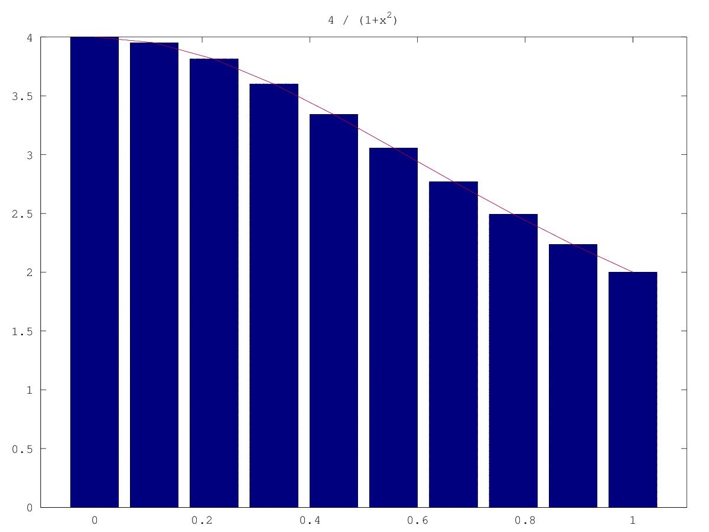

# Códigos del laboratorio 3: "Programación de GPUs y Aceleradores con directivas"

## Contenidos
* En este repositorio se encuentran los códigos propuestos en la Práctica 3 de la asignatura de [Programación de GPUs y Aceleradores](https://github.com/garsanca/GPUs)
* Para poner a punto el taller se recomienda seguir los pasos de la sección [Setup del lab](#setup-del-lab)
* Los códigos que vamos a trabajar están disponibles en la [sección "Ejemplos"](#ejemplos), resumidamente trabajan algunos de los aspectos mostrados en la parte teórica:
    * helloWorld: ilustra el proceso de compilación
    * axpy: uso de pragmas para movimiento de datos y expresión de kernel
    * jacobi: creación de más de un kernel y expresión de reducciones
    * Pi: traducción de algoritmo sencillo
* Los códigos que se han de entregar están en la [sección "Entrega evaluable"](#entrega-evaluable)
    * Tratamiento de imágen: calculo de bordes de una imágen
    * nbody: problema de n-cuerpos
    * alineamiento de secuencias: **Opcional**

# Setup del lab

## Transparencias
* Todo el material está disponible en el repositorio [github](https://github.com/garsanca/GPUs/tree/main/src/lab3)
    * Puede descargarse fácilmente clonando el repositorio ejecutando en un terminal el comando ```git clone https://github.com/garsanca/GPUs```
    * Añada a la variable de entorno PATH, la ruta del compilador de NVIDIA del [SDK-HPC](https://developer.nvidia.com/hpc-sdk): ```export PATH=/opt/nvidia/hpc_sdk/Linux_x86_64/23.5/compilers/bin:$PATH``

## Laboratorios FDI
* En los laboratorio está instalado el entorno de OpenACC soportado en NVIDIA en el [NVIDIA HPC SDK](https://developer.nvidia.com/hpc-sdk) para que pueda ser utilizado por los alumnos
* Únicamente hay que tener en cuenta:
     1. Los ejemplos disponen normalmente de un fichero **makefile** para compilar que crea ejecutable para CPU y otro para la GPU

```bash
user@host:~/helloWorld$ make
gcc -O3 -lm -lrt -std=c99 hello.c -o hello.host.exe
pgcc -Minfo -fast -acc -ta=nvidia -tp=nehalem hello.c -o hello.pgi.exe


24, Loop not fused: function call before adjacent loop
    Generated vector sse code for the loop
28, Generating copy(b[:])
    Generating Tesla code
29, Loop is parallelizable
    Accelerator kernel generated
    29, #pragma acc loop gang, vector(128) /* blockIdx.x threadIdx.x */
32, Loop not vectorized/parallelized: potential early exits
```

# Ejemplos

## helloWorld
* En este [ejemplo](helloWorld/hello.c) vamos a ver como se genera código para la CPU y para la GPU

```c
#ifdef _OPENACC
#include <openacc.h>
#endif
int main() {

#ifdef _OPENACC
     acc_init(acc_device_not_host);
     printf(" Compiling with OpenACC support \n");
#endif 

   // Compute on the GPU if OpenACC support - host if not
   #pragma acc kernels copyout(b[0:N])
   for (int i = 0; i < N; i++) {
      b[i] = i;
    }
    ...
#ifdef _OPENACC
     acc_shutdown(acc_device_not_host);
 #endif 

   return 0;
}
```

* Para compilar los código existe un fichero [Makefile](helloWorld/Makefile) que invocando **make** en consola genera los ejecutables 
    1. Para la CPU: **hello.host.exe**
    2. Para la GPU: **hello.pgi.exe**

```bash
user@host:~/ $ make pgi
pgcc -Minfo -fast -acc -ta=nvidia -tp=nehalem hello.c -o hello.pgi.exe

24, Loop not fused: function call before adjacent loop
    Generated vector sse code for the loop
28, Generating copy(b[:])
    Generating Tesla code
29, Loop is parallelizable
    Accelerator kernel generated
    29, #pragma acc loop gang, vector(128) /* blockIdx.x threadIdx.x */
32, Loop not vectorized/parallelized: potential early exits
```
## axpy
* En este [ejemplo](axpy/axpy.c) vamos a ilustrar el uso de las directivas para generar el kernel y el mapeo de datos
* Recordar que todas las directivas de OpenACC comienzan con **#pragma acc** y si el compilador no tiene esa opción las ignora


```c
...
#ifdef _OPENACC
#include <openacc.h>
#endif

int main (int argc, const char *argv[])
{
...
#ifdef _OPENACC
	acc_init(acc_device_not_host);
	int numdevices = acc_get_num_devices(acc_device_not_host);
	printf(" Compiling with OpenACC support NUM_DEVICES=%i\n", numdevices);
#endif 

...
	// SAXPY
	t0 = get_time();
	#pragma acc ....
	#pragma acc .... 
	for(i=0; i<n; i++)
		y_acc[i] = a*x_acc[i] + y_acc[i];
...

	return(1);
}
```

## Jacobi
* Método iterativo para resolución de ec. diferenciales
    * Ej: solución para la ecuación de Laplace 2D ($\nabla^2 f(x,y)=0$)

$A_{k+1}(i,j)=\frac{A_{k}(i-1,j)+A_{k}(i+1,j)+A_{k}(i,j-1)+A_{k}(i,j+1)}{4}$

```c
while ( error > tol && iter < iter_max ){
        error = 0.0;

        for( int j = 1; j < n-1; j++){
            for( int i = 1; i < m-1; i++ ){
                Anew[j][i] = 0.25 * ( A[j][i+1] + A[j][i-1]
                                    + A[j-1][i] + A[j+1][i]);
                error = fmax( error, fabs(Anew[j][i] - A[j][i]));
            }
        }

        for( int j = 1; j < n-1; j++){
            for( int i = 1; i < m-1; i++ )
            {
                A[j][i] = Anew[j][i];    
            }
        }

        if(iter % 100 == 0) printf("%5d, %0.6f\n", iter, error);
        
        iter++;
}
```

* A tener en cuenta 2 kernels claramente diferenciados:
    1. El cálculo del array **Anew**
        * Ojo: contiene operación de reducción: **max**
    2. La actualización del array **A**


## Cálculo de PI
* Se puede calcular PI mediante en la integración de la curva $\pi = \int_{0}^{1} \frac{4}{1+x^2} dx$
* Para ello se aproximará la integral como suma finita de rectángulos: $\pi \approx \sum_{i=0}^{N} F(x_i) \Delta x$



# Entrega evaluable

## Tratamiento de imágenes
* El siguiente [ejemplo](image/image.c) ilustra la detección de bordes aplicando un filtado mediante una convolución 2D


* De forma análoga a como vimos en la primera práctica se puede calcular los bordes de una imágen aplicando un filtrado en 2D de acuerdo a un kernel:

$Im_{OUT}(i,j) = \begin{bmatrix}
0  &  -1 &  0 \\
-1 &  4  & -1 \\ 
0  &  -1 &  0 \\
\end{bmatrix} Im_{IN}(i-1:i+1,j-1:j+1)$

## nbody
* En física se usa para resolver problema de la predicción de los movimientos individuales de un grupo de objetos celestes que interactúan entre sí gravitacionalmente
* El código se encuentra disponible en el [directorio **nbody**](nbody/)

## Needleman-Wunsch
* El algoritmo de Needleman-Wunsch se utiliza para calcular el mejor alineamiento de dos secuencias (genómica o proteómica)
* Dadas dos secuencias GCATGCU y GATTACA, se puede calcular la matriz de "puntuación" 


```python
def nw(a, b, S, gap_penalty):
    nx = len(a)
    ny = len(b)
    # Optimal score at each possible pair of characters.
    F = np.zeros((nx + 1, ny + 1))
    F[:,0] = np.linspace(0, -nx * gap, nx + 1) # First column
    F[0,:] = np.linspace(0, -ny * gap, ny + 1) # First row
    
    for i in range(nx):
        for j in range(ny):
            match  =  F[i-1,j-1] + S[a[i], b[j]] # S==score matrix
            delete =  F[i-1,j  ] + gap_penalty
            insert =  F[i  ,j-1] + gap_penalty
            F[i,j] =  max(match, delete, insert)
```


