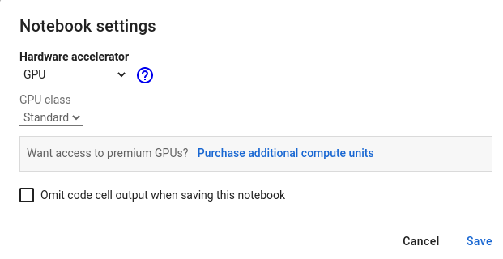
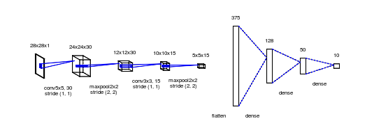

# Códigos del laboratorio 4: "Programación de GPUs para IA"

## Contenidos
* En este repositorio se encuentran los códigos propuestos en la Práctica 4 de la asignatura de [Programación de GPUs y Aceleradores](https://github.com/garsanca/GPUs)
* Para poner a punto el taller se recomienda seguir los pasos de la sección [Setup del lab](#setup-del-lab)
* Los códigos que vamos a trabajar están disponibles en la [sección "Ejemplos"](#ejemplos).

# Setup del lab
## Google Colab
* El [google-colab](https://colab.research.google.com/) permite lanzar cuadernos de Jupyter para facilitar el despliegue de un entrenamiento de una red neuronal
* Unicamente hay que asegurarse que el entorno tiene seleccionada una GPU
    * **RunTime->Change runTime type: GPU selected**



# Ejemplos
* Todo el material está disponible en el repositorio [github](https://github.com/garsanca/GPUs/tree/main/src/lab4)
    * Puede descargarse fácilmente clonando el repositorio ejecutando en un terminal el comando ```git clone https://github.com/garsanca/GPUs```

## Entrenamiento y configuración de CNN
* En python se puede importar la librería de [**tensorflow**](https://es.wikipedia.org/wiki/TensorFlow) para aprendizaje automático basado en redes neuronales y aprendizaje profundo 
* De igual manera la biblioteca [**keras**](https://es.wikipedia.org/wiki/Keras) permite el diseño e implementación de Redes tipo CNN en poco tiempo

* El ejemplo que se ilustra en el cuaderno de Jupyter [cifar10](Jupyter-notebooks/cifar10_cnn.ipynb) recoje el proceso de:
    1. Descarga del dataset
    2. Preparación del dataset al formato apropiado
    3. Creación de un modelo a entrenar (red CNN)
    4. Entrenamiento
    5. Evaluación del modelo (métricas de error)
    6. Inferencia del modelo entrenado: **predicción**

* Dicho cuaderno además guía la utilización de una red neuronal "clásica" para clasificación de imágenes como **MobileNet**

# Entrega evaluable
## Evaluación de otro dataset
* En el cuaderno de Jupyter [**ejercicio_mnist**](Jupyter-notebooks/ejercicio_mnist.ipynb) se propone implementar una red neuronal para clasificar números escritos a mano cuyo dataset se conoce con el nombre de [MNIST example](https://upload.wikimedia.org/wikipedia/commons/2/27/MnistExamples.png)




## Evaluación de otras CNN y cifar100
* En el cuaderno de Jupyter [**ejercicio_cifar**](Jupyter-notebooks/ejercicio_cifar.ipynb) se propone realizar varios ejercicios y evaluar su precisión para otros modelos CNN:
    - VGG19
    - MobileNet
    - ResNet50
* Además se propone escoger el dataset de cifar100 que clasifica 100 tipos de clases para los modelos considerados

